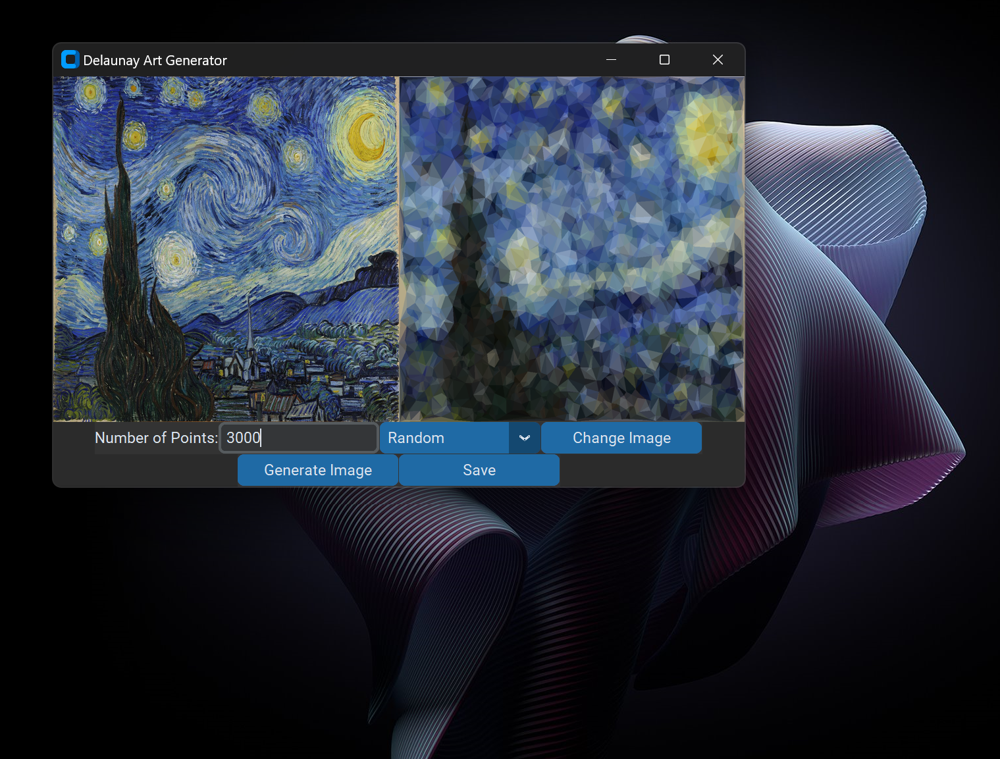
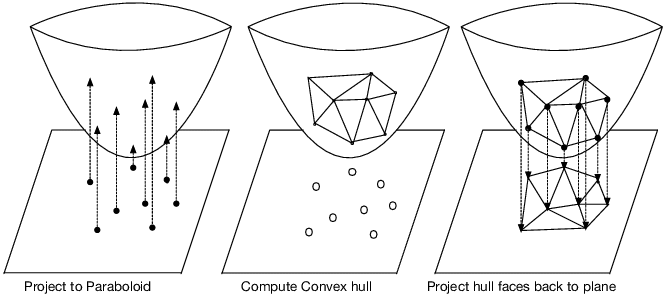

# Delaunay-Art
The goal of this project is to create Triangulation Art using Python. Work is based off of the paper "Stylized Image Triangulation" by Lawonn and Gunther. It is a work in progress and I am looking to add
more features in the future.

## Demonstration

## File Guide
- MVC_GUI.py - Main application. Simply run the script and have fun! \
- GUI.py - Original iteration of the GUI. Changed it to use an MVC model for organization and readability. \
- Delaunay Art Generator version 3.py - The code completed as a part of a geometry project at the University of San Diego. Not user friendly, and was simply used to create art images for a showcase.

## How to Use
- Run the MVC_GUI.py file
- Select number of sample points and generation type
- Hit generate to see new image
- Hit save to save the new file
- Change input image if needed
- Have fun!

## Mathematics
The algorithm behind the art is know as Delaunay Triangulation. I won't go into deep detail about how the algorithm works here, but it is neat and would recommend checking it out. In short, the algorithm yields the "fattest" triangles when triangulating a point set. There are multiple algorithms for it, but I believe the coolest is by using 3D. Yes, we will use 3 dimensions for a 2D point set. The quickest explanation I could give is that the 2D projection of the convex hull of the pointset, where z = x^2 + y^2, is the Delaunay Triangulation of the pointset. See picture for an intuitive understanding. 

Besides its practicality, the triangulation is aesthetically pleasing because of lack of "skinny" triangles. One very interesting feature of this triangulation is that it is the dual triangulation of the Voronoi diagram of the points. I would recommend 
